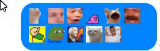

# Messenger Thumbnails

Chrome extension that adds youtube thumbnails in messenger.

## Installation

- Download this repo as a zip and unpack it locally on your computer.
- Go to chrome://extensions/
- At the top right, turn on Developer mode.
- Click Load unpacked.
- Find and select the directory where you unzipped the extension.

## Emotes

Emotes that can be used are the ones listed on the frontpage of [https://slackmojis.com/](https://slackmojis.com/)

Additionally legacy Gadu-Gadu emotes have been added aswell. But instead of using lt and gt symbols `<>` use `:`, i.e `:lol2:`
